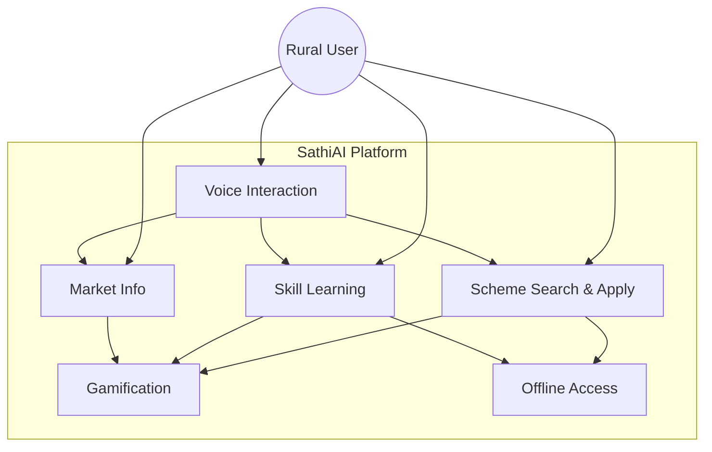
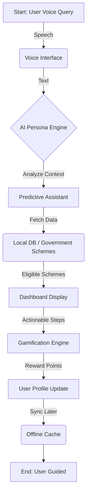
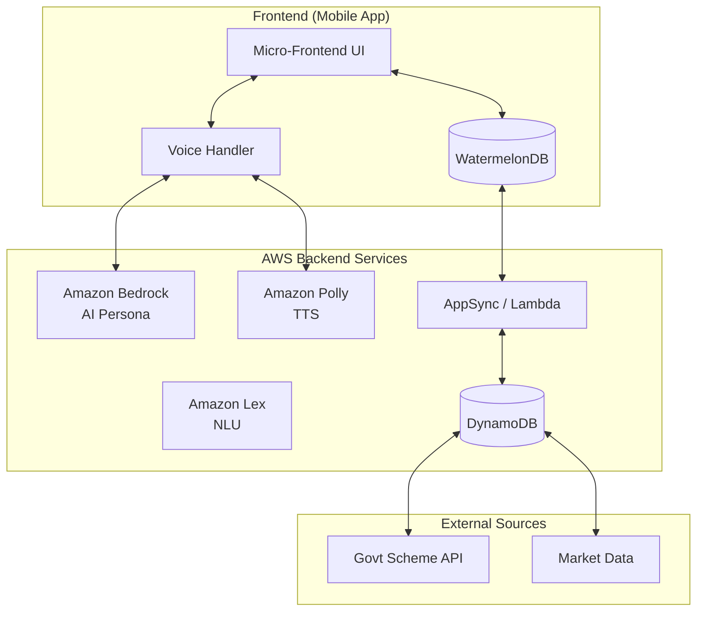

# SathiAI Platform - AWS AI for Bharat Hackathon Submission

## Title Slide
*Your Friendly Village Companion for Rural Empowerment*

**Team:** [Your Team Name]

### The Challenge
- **65% of India lives in rural areas** but lacks access to:
  - Government scheme information
  - Digital literacy support

### Pain Points
- Language barriers (Hindi + 22 regional languages)
- Limited internet connectivity
- Low digital literacy
- Complex government processes
- Lack of personalized guidance
---

## Slide 3: Solution Overview
---
## Slide 4: Key Features

### 1. AI Persona Engine
- Culturally relatable "Village Sathi" character
- Uses local idioms and familiar analogies
- Patient, step-by-step guidance
- Adapts to user literacy levels

### 2. Smart Recommendations
- **Scheme Matching:** Profile + location-based filtering
- **Skill Suggestions:** Local opportunity alignment

### 3. Gamification
- Points and badges for activities
- "Sakhi Learner" achievements
- Progress visualization
- Community leaderboards

---

## Slide 5: Technical Architecture

### AWS Services Integration
```
┌─────────────────┐    ┌──────────────────┐    ┌─────────────────┐
│   Mobile App    │    │   AWS Backend    │    │  Data Sources   │
│                 │    │                  │    │                 │
│ • React Native  │◄──►│ • Amazon Bedrock │◄──►│ • Gov Schemes   │
│ • Voice UI      │    │ • Amazon Polly   │    │ • Market Data   │
│ • Offline Cache │    │ • Amazon Lex     │    │ • Skill Content │
- **AI/ML:** Amazon Bedrock for cultural persona, Amazon Lex for voice
- **Compute:** Lambda for serverless processing
- **Voice:** Amazon Polly for multilingual TTS

---

## Slide 6: User Journey - "Meet Radha"

### Scenario: Radha, Farmer in Maharashtra
1. **Voice Query:** "Mujhe kheti ke liye scheme chahiye" (I need farming schemes)
2. **AI Response:** Uses local Marathi references, suggests PM-Kisan
3. **Guided Application:** Step-by-step process in her language
4. **Skill Recommendation:** Organic farming training nearby
5. **Market Alert:** "Tomato prices high in Pune tomorrow"

**Result:** Access to 2 schemes + 1 skill program in under 2 minutes

---
### 🎯 Cultural AI Persona
- First AI assistant designed for Indian rural context
### 🌐 Offline-First Architecture  
- Core features work without internet
### 🎮 Gamified Engagement
- Culturally relevant rewards system
### 🗣️ True Multilingual Support
- Code-switching support (Hindi-English mix)
- Regional accent adaptation

---
### Target Market
- **650+ million rural Indians**
- **146 million farming households**
- **Growing smartphone penetration** (77% by 2025)

### Scalability Plan
1. **Phase 1:** Maharashtra (Pilot) - 10,000 users
### Revenue Model
- **B2B:** Corporate skill training programs
- **Freemium:** Premium features for advanced users

---
### Development Approach
- **Spec-Driven Development** with property-based testing
- **Response Time:** <10 seconds for queries
- **Offline Capability:** 80% features work offline
- Property-based testing for universal correctness
- Performance testing on basic smartphones
- Voice recognition accuracy across accents

---

## Slide 10: Demo Flow

### Live Demo Scenario
1. **Voice Input:** "Mujhe naya skill seekhna hai" (I want to learn new skills)
2. **AI Processing:** Cultural context + location analysis
3. **Personalized Response:** Suggests tailored programs
4. **Visual Dashboard:** Shows progress, next steps, nearby centers
5. **Gamification:** Awards points, shows achievement progress
6. **Offline Test:** Demonstrates cached functionality
**Demo Duration:** 3 minutes
**Key Showcase:** Voice interaction, cultural adaptation, offline capability

---
### For Government
- **Increased Scheme Uptake:** 40% improvement in rural program adoption
### For Users  
- **Time Savings:** 80% reduction in scheme discovery time
### For Ecosystem
- **Digital India:** Furthers government digitization goals
- **Innovation:** Replicable model for rural tech solutions

---

## Slide 12: Competitive Advantage

### What Makes SathiAI Unique

| Feature | SathiAI | Competitors |
|---------|---------|-------------|
| Cultural AI Persona | ✅ Village Sathi character | ❌ Generic chatbots |
| Offline-First | ✅ 80% features work offline | ❌ Internet dependent |
| True Multilingual | ✅ Real-time switching | ⚠️ Limited language support |
- Deep rural market understanding
- Government partnership network
- Offline-first technical architecture

---

## Slide 13: Implementation Timeline
**Month 1-2: Foundation**
- Core AI persona development
**Month 3-4: Features**  
- Predictive recommendations
**Month 5-6: Scale**
- Multi-language support
- ✅ Spec completed (Current)
- 🎯 Pilot launch (Month 4)
- 🎯 Scale deployment (Month 6)

---
- **AI/ML Engineering:** Cultural AI, voice processing
- **Rural Market Knowledge:** Deep understanding of user needs
- **AWS Credits:** $10,000 for development and testing
- **Mentorship:** Rural market go-to-strategy
- **10,000 active users** in pilot phase
- **40% increase** in scheme applications
- **Replicable model** for other states

---

## Slide 15: Call to Action

### Join Us in Empowering Rural India

**Vision:** Every rural Indian has a digital companion that speaks their language, understands their culture, and guides them to opportunities.

**Mission:** Bridge the digital divide through culturally intelligent AI that makes government services, skills, and market information accessible to all.

### Next Steps
1. **Pilot Partnership:** Launch in Maharashtra
2. **Government Collaboration:** Integrate official scheme databases  
3. **Community Building:** Engage rural user groups
4. **Scale Strategy:** Expand to 5 states by year-end
**Contact:** [Your Contact Information]

---

---

## Appendix: Diagrams

### 1. High-Level Use Case Diagram


### 2. Process Flow: "Guidance for a Scheme"


### 3. System Architecture

