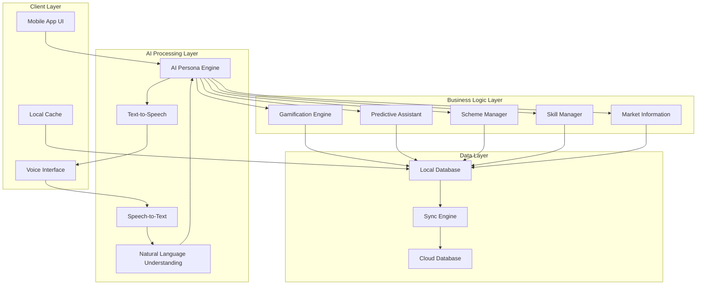

# Design Document: SathiAI Platform

## Overview

The SathiAI Platform is a comprehensive AI-powered assistant designed specifically for rural users in India. The system combines a culturally relatable AI persona, gamification mechanics, predictive assistance, multilingual voice interfaces, and offline-first architecture to provide seamless access to government schemes, skill learning programs, and market information.

The platform addresses the unique challenges of rural India including limited literacy, poor connectivity, language diversity, and cultural barriers to technology adoption. By positioning itself as a "village Sathi" (friend/companion), the system creates a trusted, familiar interaction model that encourages engagement and learning.

## Architecture

The SathiAI Platform follows a modular, offline-first architecture optimized for low-bandwidth environments:



### Key Architectural Principles

1. **Offline-First Design**: Core functionality works without internet connectivity
2. **Progressive Enhancement**: Features improve with better connectivity
3. **Modular Components**: Each system component can operate independently
4. **Cultural Adaptation**: All interactions filtered through cultural context layer
5. **Performance Optimization**: Minimal resource usage for basic smartphones

## Components and Interfaces

### AI Persona Engine

The AI Persona Engine serves as the central interaction layer, providing culturally appropriate responses and maintaining conversation context.

**Core Responsibilities:**
- Generate culturally appropriate responses using local idioms and familiar analogies
- Maintain conversation context across sessions and language switches
- Adapt communication style based on user literacy level and preferences
- Provide patient, step-by-step guidance for complex processes

**Interface:**
```typescript
interface PersonaEngine {
  generateResponse(userInput: string, context: ConversationContext): PersonaResponse
  adaptTone(userProfile: UserProfile): ToneSettings
  translateConcept(concept: string, culturalContext: CulturalContext): string
  maintainContext(sessionId: string, interaction: Interaction): void
}

interface PersonaResponse {
  text: string
  audioUrl?: string
  culturalReferences: string[]
  simplificationLevel: number
  nextSteps?: ActionStep[]
}
```

### Multilingual Voice Interface

Handles speech recognition and synthesis across Hindi and regional Indian languages, with support for code-switching and dialect variations.

**Core Responsibilities:**
- Process speech input in multiple Indian languages simultaneously
- Handle mid-conversation language switching
- Generate natural-sounding speech output with appropriate accents
- Maintain conversation flow across language boundaries

**Interface:**
```typescript
interface VoiceInterface {
  recognizeSpeech(audioData: AudioBuffer): SpeechRecognitionResult
  synthesizeSpeech(text: string, language: Language, accent: Accent): AudioBuffer
  detectLanguage(audioData: AudioBuffer): Language[]
  handleCodeSwitching(mixedLanguageInput: string): ProcessedInput
}

interface SpeechRecognitionResult {
  text: string
  confidence: number
  detectedLanguages: Language[]
  culturalMarkers: string[]
}
```

### Gamification Engine

Manages user engagement through culturally relevant rewards, progress tracking, and achievement systems.

**Core Responsibilities:**
- Award points and badges for completed activities
- Track progress across skill modules and scheme applications
- Generate motivational feedback and celebrations
- Maintain user engagement metrics

**Interface:**
```typescript
interface GamificationEngine {
  awardPoints(userId: string, activity: Activity, points: number): void
  unlockBadge(userId: string, badge: Badge): void
  trackProgress(userId: string, module: SkillModule): ProgressUpdate
  generateCelebration(achievement: Achievement): CelebrationResponse
  getLeaderboard(category: string, location: Location): Leaderboard
}

interface Badge {
  id: string
  name: string
  description: string
  culturalSignificance: string
  visualAsset: string
}
```

### Predictive Assistant

Provides proactive recommendations based on user profile, location, seasonal patterns, and market conditions.

**Core Responsibilities:**
- Generate personalized scheme recommendations
- Predict optimal timing for market activities
- Suggest relevant skill development opportunities
- Learn from user interactions to improve predictions

**Interface:**
```typescript
interface PredictiveAssistant {
  recommendSchemes(userProfile: UserProfile): SchemeRecommendation[]
  predictMarketTiming(crop: Crop, location: Location): MarketPrediction
  suggestSkills(userProfile: UserProfile, localOpportunities: Opportunity[]): SkillSuggestion[]
  learnFromFeedback(recommendation: Recommendation, userFeedback: Feedback): void
}

interface SchemeRecommendation {
  scheme: GovernmentScheme
  relevanceScore: number
  eligibilityMatch: number
  applicationDeadline: Date
  estimatedBenefit: number
}
```

### Cache Manager

Handles offline functionality through intelligent caching of essential data and progressive synchronization.

**Core Responsibilities:**
- Cache frequently accessed scheme information
- Store user progress and achievements locally
- Sync data when connectivity is available
- Optimize data usage through compression and prioritization

**Interface:**
```typescript
interface CacheManager {
  cacheSchemeData(schemes: GovernmentScheme[]): void
  cacheMarketData(marketInfo: MarketInformation[]): void
  syncUserProgress(userId: string): SyncResult
  optimizeDataUsage(priority: Priority): void
  getOfflineCapabilities(): OfflineFeature[]
}

interface SyncResult {
  success: boolean
  syncedItems: number
  conflicts: DataConflict[]
  nextSyncTime: Date
}
```

## Data Models

### User Profile
```typescript
interface UserProfile {
  id: string
  name: string
  location: Location
  primaryLanguage: Language
  secondaryLanguages: Language[]
  literacyLevel: LiteracyLevel
  occupation: Occupation
  landHolding?: number
  familySize: number
  phoneNumber: string
  preferredCommunicationMode: CommunicationMode
  culturalContext: CulturalContext
}

interface Location {
  state: string
  district: string
  block: string
  village: string
  pincode: string
  coordinates: GeoCoordinates
}
```

### Government Scheme
```typescript
interface GovernmentScheme {
  id: string
  name: string
  description: string
  eligibilityCriteria: EligibilityCriterion[]
  benefits: Benefit[]
  applicationProcess: ApplicationStep[]
  documents: RequiredDocument[]
  deadlines: Date[]
  targetAudience: TargetAudience
  geographicScope: GeographicScope
  status: SchemeStatus
}

interface EligibilityCriterion {
  type: CriterionType
  value: any
  description: string
  verificationMethod: VerificationMethod
}
```

### Skill Module
```typescript
interface SkillModule {
  id: string
  title: string
  description: string
  category: SkillCategory
  difficulty: DifficultyLevel
  duration: number
  prerequisites: string[]
  learningObjectives: string[]
  content: ModuleContent[]
  assessments: Assessment[]
  certification: Certification
  localRelevance: LocalRelevanceScore
}

interface ModuleContent {
  type: ContentType
  title: string
  content: string
  mediaUrl?: string
  interactiveElements: InteractiveElement[]
}
```

### Market Information
```typescript
interface MarketInformation {
  id: string
  crop: Crop
  location: Location
  currentPrice: Price
  priceHistory: PricePoint[]
  marketTrends: Trend[]
  demandForecast: Forecast
  transportationOptions: TransportOption[]
  storageRecommendations: StorageAdvice[]
  qualityRequirements: QualityStandard[]
}

interface Price {
  value: number
  currency: string
  unit: string
  lastUpdated: Date
  source: string
  reliability: ReliabilityScore
}
```

### Gamification Data
```typescript
interface UserProgress {
  userId: string
  totalPoints: number
  level: number
  badges: Badge[]
  achievements: Achievement[]
  streaks: Streak[]
  completedModules: string[]
  appliedSchemes: string[]
  marketInteractions: number
}

interface Achievement {
  id: string
  name: string
  description: string
  unlockedDate: Date
  category: AchievementCategory
  points: number
  culturalCelebration: string
}
```

## Correctness Properties

*A property is a characteristic or behavior that should hold true across all valid executions of a system—essentially, a formal statement about what the system should do. Properties serve as the bridge between human-readable specifications and machine-verifiable correctness guarantees.*

### Property 1: Cultural Persona Consistency
*For any* user interaction and cultural context, the AI persona should generate responses that contain appropriate cultural markers, use familiar rural analogies, maintain friendly tone, and break complex processes into conversational steps.
**Validates: Requirements 1.1, 1.2, 1.3, 1.4, 1.5**

### Property 2: Gamification Reward Completeness  
*For any* completed user activity (skill modules, scheme applications, market inquiries), the gamification engine should award appropriate points, record achievements, track engagement, and provide celebratory feedback when milestones are reached.
**Validates: Requirements 2.1, 2.2, 2.3, 2.5**

### Property 3: Progress Visualization Consistency
*For any* ongoing user activity, the system should display visual progress indicators and provide clear visual cues for required actions.
**Validates: Requirements 2.4, 5.4, 5.5**

### Property 4: Predictive Recommendation Accuracy
*For any* user profile and location, the predictive assistant should generate relevant scheme recommendations, filter suggestions by location, and learn from user feedback to improve future recommendations.
**Validates: Requirements 3.1, 3.2, 3.4, 7.1**

### Property 5: Proactive Notification Timeliness
*For any* market condition change or seasonal opportunity, the predictive assistant should proactively suggest optimal timing and notify users of time-sensitive programs.
**Validates: Requirements 3.3, 3.5, 9.2, 9.4**

### Property 6: Multilingual Conversation Continuity
*For any* voice conversation in supported languages, the interface should understand input, respond appropriately, handle mid-conversation language switches, maintain context across language changes, and provide simultaneous text and speech output.
**Validates: Requirements 4.1, 4.2, 4.3, 4.5**

### Property 7: Offline Functionality Preservation
*For any* core system feature, when internet connectivity is unavailable, the cache manager should provide access using cached data and use pre-cached responses for common queries.
**Validates: Requirements 4.4, 6.1, 6.3**

### Property 8: Dashboard Information Completeness
*For any* user query with available information, the dashboard should display AI-generated summaries, present action steps as numbered lists, and integrate relevant maps or external links into the workflow.
**Validates: Requirements 5.1, 5.2, 5.3**

### Property 9: Data Synchronization Consistency
*For any* connectivity restoration event, the cache manager should sync user progress, update cached content, prioritize essential information loading, and compress all data transfers.
**Validates: Requirements 6.2, 6.4, 6.5**

### Property 10: Scheme Information Accuracy
*For any* government scheme display, the system should provide clear eligibility criteria, application steps, step-by-step guidance when requested, and maintain updated availability and deadline information.
**Validates: Requirements 7.2, 7.3, 7.4, 7.5**

### Property 11: Skill Learning Integration
*For any* skill development interest, the system should recommend appropriate modules, track progress with encouragement, offer locally relevant programs, provide certificates upon completion, and connect learning to job opportunities.
**Validates: Requirements 8.1, 8.2, 8.3, 8.4, 8.5**

### Property 12: Market Information Completeness
*For any* crop and location combination, the system should provide current market rates, nearby market information, transportation options, and guidance on storage and post-harvest handling.
**Validates: Requirements 9.1, 9.3, 9.5**

### Property 13: Response Time Performance
*For any* user query or interface interaction, the system should provide initial responses within 10 seconds, respond to interactions within 2 seconds, and complete typical workflows within 2 minutes.
**Validates: Requirements 10.1, 10.2, 10.3**

### Property 14: User Feedback Consistency
*For any* user action, the system should provide clear visual and audio feedback to confirm the action was received and processed.
**Validates: Requirements 10.4**

### Property 15: Error Recovery Completeness
*For any* error condition, the system should provide helpful error messages and clear recovery options to help users continue their tasks.
**Validates: Requirements 10.5**

## Error Handling

The SathiAI Platform implements comprehensive error handling across all system components:

### Network Connectivity Errors
- **Graceful Degradation**: When connectivity is lost, the system automatically switches to cached data
- **User Notification**: Clear, culturally appropriate messages inform users about connectivity status
- **Automatic Recovery**: System automatically resumes full functionality when connectivity is restored
- **Progress Preservation**: All user progress is saved locally and synced when possible

### Voice Recognition Errors
- **Fallback Mechanisms**: If speech recognition fails, system prompts for text input or simplified speech
- **Language Detection**: Multiple language detection attempts with user confirmation
- **Noise Handling**: Background noise filtering with requests for clearer audio when needed
- **Context Preservation**: Conversation context maintained even when individual utterances fail

### Data Validation Errors
- **Input Sanitization**: All user inputs validated and sanitized before processing
- **Graceful Failures**: Invalid data handled with helpful error messages and correction suggestions
- **Cultural Sensitivity**: Error messages use appropriate language and tone for rural users
- **Recovery Guidance**: Clear steps provided to correct errors and continue workflows

### System Performance Errors
- **Timeout Handling**: Graceful handling of slow operations with progress indicators
- **Resource Management**: Automatic cleanup of resources to prevent memory issues
- **Fallback Responses**: Pre-cached responses used when real-time processing fails
- **User Communication**: Clear communication about delays and expected resolution times

## Testing Strategy

The SathiAI Platform employs a comprehensive dual testing approach combining unit tests for specific scenarios and property-based tests for universal correctness validation.

### Property-Based Testing Framework

**Technology Stack**: 
- **Primary**: Hypothesis (Python) for backend services
- **Frontend**: fast-check (TypeScript) for mobile app components
- **Voice**: Custom property generators for multilingual audio testing

**Test Configuration**:
- **Minimum Iterations**: 100 per property test to ensure statistical significance
- **Timeout Settings**: 30 seconds per property to accommodate voice processing
- **Data Generation**: Custom generators for Indian cultural contexts, languages, and rural scenarios

**Property Test Implementation**:
Each correctness property will be implemented as a single property-based test with the following tag format:
```
Feature: sathiai-platform, Property {number}: {property_text}
```

**Example Property Test Structure**:
```python
@given(user_profile=indian_rural_user_profiles(), 
       cultural_context=indian_cultural_contexts())
def test_cultural_persona_consistency(user_profile, cultural_context):
    """Feature: sathiai-platform, Property 1: Cultural Persona Consistency"""
    response = persona_engine.generate_response(
        user_input="Help me with farming schemes",
        context=ConversationContext(user_profile, cultural_context)
    )
    
    assert contains_cultural_markers(response.text, cultural_context)
    assert uses_rural_analogies(response.text)
    assert maintains_friendly_tone(response.text)
    assert has_conversational_steps(response.text)
```

### Unit Testing Strategy

**Focus Areas**:
- **Integration Points**: Testing connections between system components
- **Edge Cases**: Boundary conditions and unusual input scenarios  
- **Error Conditions**: Specific error scenarios and recovery paths
- **Cultural Examples**: Specific cultural interactions and language patterns

**Unit Test Balance**:
- Unit tests complement property tests by validating specific examples
- Property tests handle comprehensive input coverage through randomization
- Together they provide complete validation coverage

**Example Unit Test Categories**:
```python
class TestCulturalPersona:
    def test_hindi_greeting_with_namaste(self):
        """Specific example of Hindi cultural greeting"""
        
    def test_marathi_farming_analogy(self):
        """Specific example of Marathi rural analogy"""
        
    def test_confusion_response_simplification(self):
        """Specific example of language simplification"""
```

### Integration Testing

**End-to-End Workflows**:
- Complete user journeys from query to action completion
- Cross-component data flow validation
- Offline-to-online transition scenarios
- Multi-language conversation flows

**Performance Testing**:
- Response time validation under various network conditions
- Memory usage optimization for basic smartphones
- Battery consumption monitoring during voice interactions
- Concurrent user load testing

### Cultural and Linguistic Testing

**Language Coverage**:
- Hindi with regional variations (Delhi, UP, Bihar dialects)
- Major regional languages (Tamil, Telugu, Marathi, Gujarati, Bengali)
- Code-switching scenarios (Hindi-English, regional-Hindi combinations)
- Accent and pronunciation variations

**Cultural Validation**:
- Appropriate use of cultural references and idioms
- Respectful handling of cultural sensitivities
- Seasonal and festival-aware interactions
- Gender-appropriate communication patterns

### Accessibility Testing

**Low-Literacy Support**:
- Voice-first interaction validation
- Visual simplicity and clarity testing
- Icon and symbol comprehension testing
- Error message clarity for low-literacy users

**Device Compatibility**:
- Basic smartphone performance testing
- Low-memory device optimization validation
- Slow processor handling verification
- Battery optimization testing